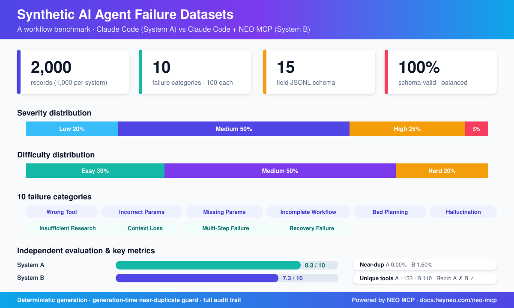
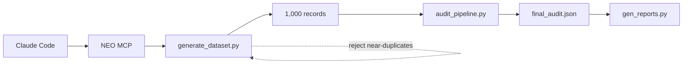

# From Dataset Generation to Dataset Engineering: What Changed When We Added NEO MCP

  

## Executive Summary

We ran a benchmark to compare two workflows for generating a 1,000-record synthetic dataset of AI agent failures: Claude Code alone, and Claude Code augmented with NEO MCP. Both workflows produced datasets that met the same contractual requirements—10 failure categories, balanced severity and difficulty distributions, 15-field JSONL schema, and full audit coverage.

The benchmark revealed a distinction that matters for anyone scaling synthetic data work: **dataset generation quality** and **dataset engineering quality** are different problems. Claude Code optimized for generation quality—prose richness, lexical diversity, and tool-name variety. NEO MCP optimized for engineering quality—reproducibility, validation, auditability, and traceability. **NEO MCP improved workflow quality rather than dataset diversity.** The result is not a better dataset in every dimension, but a more governable, maintainable, and auditable generation pipeline.

---
## Before vs. After

**Before NEO MCP:** the Claude Code baseline split generation across 40 parallel subagents, deduplicated after the fact, and produced prose audit reports that needed a human to read before catching problems. Nothing about it was reproducible: a second run wouldn't produce the same dataset. Shipping required a manual patch loop, 7 records hand-corrected before publish.

**After NEO MCP:** a 3-script pipeline (`generate_dataset.py`, `audit_pipeline.py`, `gen_reports.py`) runs from a fixed seed, rejects near-duplicate candidates during generation instead of after, and outputs a machine-readable `final_audit.json` with 9 scored components and pass/fail flags. Same seed, same dataset, same metrics, every time.

### What Changed Under The Hood

- **Validation moved earlier.** A streaming `HashingVectorizer` rejected near-duplicate candidates as they were generated (cosine similarity above 0.50), not in a cleanup pass afterward. Roughly 44,000 candidates were rejected to land the 1,000 accepted records, for a 1.60% near-duplicate rate at the stricter 0.85 audit threshold, with zero post-hoc fixes required.
- **Audits became data.** `final_audit.json` scores 9 components (schema, exact/near-duplicate, category/severity/difficulty balance, tool/root-cause/recovery diversity) into one composite score, 98.4 out of 100, plus entropy metrics for root-cause and recovery-step phrasing.
- **Determinism.** Fixed seed, default 42. Rerun it and you get the same dataset and the same metrics, byte-for-byte.
- **Fewer moving parts.** 3 scripts replace 40 subagent dispatches, an orchestrator, and a separate report-building step.

*NEO MCP is the agent's local execution layer: it's what lets Claude Code run and rerun the scripts deterministically instead of re-authoring records from scratch each time.*

### Why This Matters Beyond This Benchmark

This isn't really about one dataset. It's about whether a synthetic data pipeline is a one-off script or a maintained asset.

- **Versioning.** A deterministic seed means you can pin a dataset version and regenerate it exactly when someone asks how it was built.
- **CI gating.** `final_audit.json`'s component scores and pass/fail flags can fail a build automatically, instead of someone eyeballing a markdown report before merging a dataset update.
- **Onboarding.** 3 scripts a new engineer can read in an afternoon, instead of reconstructing the logic of 40 subagent prompts and an orchestrator's merge step.

Worth saying plainly: this comes at a real cost. Tool vocabulary drops from 1,133 unique names to 110, and the generation itself is template-based rather than freely authored. You're not getting a better dataset on every axis. You're getting one you can rerun, gate, and explain to a new teammate without a debrief.

## The Problem

Generating synthetic records is easy. Engineering a trustworthy synthetic dataset at scale is not.

At small scales—a few dozen examples—teams can hand-curate, spot-check, and ship data with informal review. Problems are visible. Corrections are cheap. But as dataset size grows, a new class of failure modes appears: hidden duplicates that leak into training, coverage drift where some categories become underrepresented, irreproducible artifacts that cannot be regenerated for ablation studies, and generation runs that pass every explicit check but silently degrade on dimensions no one thought to measure.

Governance becomes critical at scale. Who approved this dataset version? Could a reviewer regenerate it independently to verify the reported metrics? Which records were changed in the last iteration, and why? Without instrumentation around the generation process, these questions go unanswered.

We benchmarked two workflows to see how they handled these engineering challenges. The synthetic data generation task was concrete: produce 1,000 failure records across 10 categories, with exact distributions, a defined schema, and accompanying audit artifacts. The results exposed where each workflow invested its effort—and where it did not.

---

## Dataset Generation vs. Dataset Engineering

The benchmark made explicit a distinction that is often conflated: the quality of the generated records is not the same as the quality of the process that produced them.

**Dataset Generation Quality** is what most people think about when they talk about synthetic data quality. It includes lexical diversity, narrative realism, tool coverage, scenario variety, and the richness of individual records. At 100 records, these properties dominate. A small dataset can be high-quality because every record was lovingly authored, even if the process is ad hoc and undocumented.

**Dataset Engineering Quality** is the discipline around the generation process itself. It includes reproducibility, validation, auditing, quality gates, governance, and traceability. These properties emerge as load-bearing at 1,000 records and become critical at 10,000. A dataset that cannot be regenerated identically cannot be versioned. A dataset without machine-readable audit artifacts cannot be gated in CI. A dataset without generation-time checks may accumulate duplicates that only surface after publication.

Here is how the scale argument maps to the benchmark evidence:

**At 100 records**, generation quality is the bottleneck. One careful author can produce a diverse, realistic dataset. The Claude Code workflow reflects this regime: 40 parallel LLM authors, each confined to a small chunk, produced 1,133 unique tool names and recovery steps that rarely repeated. Post-hoc validation was sufficient.

**At 1,000 records**, validation becomes essential. The NEO MCP workflow encodes this. A streaming `HashingVectorizer` rejected approximately 44,000 candidates during generation, keeping 1,000 records with a measured near-duplicate rate of 1.60%—below a 5% intervention threshold—without any post-hoc fixes. The audit output is machine-readable, with 9 component scores and a composite quality score of 98.4 out of 100.

**At 10,000 records**, governance becomes non-negotiable. The NEO MCP artifacts hint at what this looks like: deterministic seed-based regeneration, component-scored reports that can feed CI gating, and a three-script pipeline that a new team member can read and understand in an afternoon. The Claude Code artifacts, by contrast, require reconstructing the logic of 40 subagent prompts and a multi-step orchestrator.

The benchmark does not argue that one dimension matters more than the other. It argues that they are separable, and that teams should know which dimension they are optimizing for.

---

## Baseline Workflow

The Claude Code baseline used an LLM-orchestrated, multi-subagent strategy. An orchestrator published a detailed spec document with anchor examples and quality rules, generated per-chunk assignment files, and launched 40 parallel subagents. Each subagent wrote 25 JSONL records to a dedicated file. After collection, the orchestrator ran validation, deduplication, and audit tools, merged the batches, and applied a single improvement loop to patch 7 records before publication.

The artifact set reflected this architecture: 10 batch JSONL files, 10 batch audit JSONs, a global audit JSON, a taxonomy definition, a methodology document, coverage and audit reports, a dataset summary, 40 subagent assignment prompts, and the merged dataset file.

**Strengths of this approach:**

The resulting dataset had exceptional vocabulary breadth—1,133 unique tool names across `expected_tools`, including realistic MCP paths such as `mcp__github__create_pull_request`, cloud APIs like `bigquery.jobs.query`, and common CLI tools. The `failure_type` field contained 1,000 unique strings. Recovery plans were highly specific: 4,916 of 4,928 recovery steps were unique, with the most-repeated step appearing only three times. Mean nearest-neighbor similarity on the audited text fields was 0.026, with a maximum of 0.157 at the 3-gram Jaccard threshold of 0.50. The staged generation—40 independent LLM authors, each operating in a distinct chunk—reduced the risk of template collapse.

**Architectural characteristics:**

The baseline was expensive to operate but high in authorial diversity. The LLM authors brought knowledge of real APIs, real failure modes, and real domains, which surfaced as differentiated tool names and varied phrasing. The tradeoff was that the process was not deterministic. Re-running the pipeline would not produce byte-for-byte identical outputs. The deduplication was post-hoc, meaning the system generated candidates before rejecting them. The assignment distribution logic was encoded in a single script, not parameterized in a configuration file, making domain rotation difficult to reconstruct from the output alone.

---

## What Changed With NEO MCP

NEO MCP introduced a structured, deterministic pipeline around the generation process. The workflow was planned before generation began, executed through three Python scripts, and audited through machine-readable JSON outputs. The change was not in the LLM authoring model—generation remained template-based with parameterized slot-filling—but in the engineering discipline applied to the pipeline.

**Planning:** The NEO MCP workflow began with a explicit plan document. It documented the reference datasets studied (BFCL v3, xLAM 60K, GAIA), the composition strategy, explicit numeric evaluation criteria (category balance ±10%, severity ±2%, duplicate thresholds), and the subtask sequencing. This made the generation strategy reviewable before a single record was produced.

**Validation:** The generation script incorporated a near-duplicate guard during candidate generation, not after. The audit script added TF-IDF cosine similarity checks at a 0.85 threshold, category and severity distribution analysis with chi-square statistics, root-cause and recovery diversity entropy metrics, and a component-scored quality gate.

**Audit generation:** Rather than prose summaries and per-batch JSONs requiring manual inspection, NEO MCP produced a `final_audit.json` with numeric component scores, pass/fail flags, and entropy measurements that can be consumed programmatically.

**Reproducibility controls:** The generation script accepted a fixed seed (default 42). Re-running from that seed produces byte-for-byte identical outputs and identical audit metrics, making the artifact auditable by any reviewer with the same script.

The net effect was a workflow that traded some generation-time flexibility for process-time rigor.

---

## Four Workflow Improvements Introduced By NEO MCP

### Deterministic Reproducibility

**What changed** The baseline workflow produced different outputs on each run, because the 40 subagents authored prose non-deterministically. The NEO MCP workflow seeded its random number generator at 42 and used parameterized template filling that produces identical outputs given identical inputs.

**Evidence** The generation methodology states: "Everything is deterministic from `--seed` (default 42). Re-running reproduces the dataset and every metric byte-for-byte." No equivalent guarantee exists in the Claude Code artifact set.

**Why it matters** Reproducibility is a prerequisite for ablations, dataset versioning, and peer review. If a reviewer cannot regenerate the artifact to verify a reported metric, the metric is an assertion rather than a result. Determinism also makes it possible to revert to a known-good dataset version if a subsequent generation introduces regressions.

**Tradeoffs** Determinism in this implementation came from template-based generation, which narrowed the tool vocabulary to 110 unique tools and introduced detectable phrasing patterns within categories. The Claude Code baseline's 40-author heterogeneity produced 1,133 unique tools; reproducibility was sacrificed for that breadth. Teams must choose which property is non-negotiable for their use case.

---

### Generation-Time Validation

**What changed** The baseline performed deduplication post-hoc. The NEO MCP workflow rejected candidates during generation if their similarity to already-accepted records exceeded a configured threshold.

**Evidence** The methodology documents a streaming `HashingVectorizer` that rejects candidates whose cosine similarity to any accepted example exceeds 0.50. The final audit reports 16 near-duplicate pairs at the stricter audit threshold of 0.85—a rate of 1.60%—with no post-hoc fixes required. The plan explicitly states the intervention target is below 5%.

**Why it matters** Post-hoc deduplication means the system expends cycles generating candidates it will later discard, and the resulting dataset depends on the cleanup step rather than being clean by construction. Generation-time guards enforce quality as a first-class constraint of the generation process, not an afterthought. The 43,000-to-1 rejection ratio (~44,000 rejected to land 1,000 accepted) quantifies the discipline of the guard: the system actively defended against duplication rather than detecting it retrospectively.

**Tradeoffs** The guard operates on lexical similarity, not semantic similarity. Two records that paraphrase the same scenario using different words may pass the guard and still be near-duplicates from a human perspective. A semantic embedding pass would add cost and complexity. The guard also imposes a generation-time performance cost proportional to the corpus size, which matters at scales beyond 10,000 records.

---

### Auditability And Traceability

**What changed** The baseline produced audits as prose markdown and per-batch JSONs with counts and top frequencies. The NEO MCP workflow produced component-scored, machine-readable audit outputs with entropy metrics and pass/fail flags.

**Evidence** `final_audit.json` contains a `quality_score` object with nine components: `schema_score`, `exact_dup_score`, `near_dup_score`, `category_balance_score`, `severity_score`, `difficulty_score`, `tool_diversity_score`, `root_cause_diversity_score`, and `recovery_diversity_score`, each with a numeric value. A `composite_quality_score` of 98.4 aggregates these components. The audit also reports `root_cause_entropy` (6.062 bits) and `first_step_pattern_entropy` (5.071 bits), quantifying the unpredictability of root-cause and recovery-plan openings.

**Why it matters** Numeric component scores enable pass/fail gating in CI pipelines. A reviewer can write a check that fails the build if, for example, `tool_diversity_score` drops below a threshold, without manually inspecting the dataset. Entropy metrics quantify the risk of template collapse—if root-cause entropy is low, human reviewers know to look for category-fixed phrasing before publication. The Claude Code artifacts required manual inspection to surface these patterns; the NEO MCP artifacts report them as first-class metrics.

**Tradeoffs** Score components must be designed carefully. An entropy metric that does not align with a meaningful notion of diversity can produce false confidence. The `root_cause_entropy` of 6.062 bits in NEO MCP is computed over 194 opening patterns across 1,000 records, which suggests that a small number of patterns account for a large share of the corpus—a risk the entropy figure alone does not fully quantify.

---

### Operational Simplicity

**What changed** The baseline required `make_assignments.py` to produce 40 assignment files, orchestrated dispatch to 40 parallel subagents, reconciliation of their outputs, and `build_reports.py` to derive reports from per-batch artifacts. NEO MCP reduced this to three Python scripts and a plan document.

**Evidence** `plan.md` lists `generate_dataset.py`, `audit_pipeline.py`, and `gen_reports.py` as the pipeline, with no external orchestration dependencies beyond scikit-learn. The Claude Code workflow required 40 subagent dispatches, parallel orchestration, and a dedicated report-building step to aggregate per-batch JSONs into the global audit.

**Why it matters** Fewer moving parts means fewer failure modes. Subagent crashes, context-window limits, and assignment-file drift are not concerns in a three-script pipeline. A new engineer can read `generate_dataset.py` and understand the generation logic in an afternoon. In the baseline, the logic is distributed across 40 authored prompts and the orchestrator's merge logic, making the system harder to modify and harder to debug.

**Tradeoffs** The simplicity of the three-script pipeline comes from template-based generation, which limits the expressive range of the output. The multi-subagent approach, while complex, distributed the authoring load across heterogeneous contexts, producing more varied prose. Operational simplicity is valuable when the dataset is a maintained engineering asset; it is a constraint when the dataset is a one-time artifact.

---

## Results

The quantitative comparison is organized around what each workflow measured, then what it did not.

### Engineering Metrics

| Dimension | Claude Code | Claude Code + NEO MCP |
|-----------|-------------|----------------------|
| Records | 1,000 | 1,000 |
| Schema errors | 0 | 0 |
| Exact duplicates | 0 | 0 |
| Near-duplicate rate | 0.00% at Jaccard ≥ 0.50 | 1.60% at TF-IDF cosine ≥ 0.85 |
| Deterministic reproduction | No | Yes (seed 42) |
| Generation-time guard | No | Yes (cosine > 0.50 during generation) |
| Audit component scores | 11 metrics in JSON | 9 scored components + entropy + composite 98.4 |
| CI-gatable outputs | No | Yes (JSON with pass/fail flags) |
| Pipeline scripts | Multi-step + orchestrator | 3 Python scripts |
| Subagent dispatches | 40 parallel | 0 |
| Improvement loop | 7 records patched | None required on first run |

### Diversity Metrics

| Dimension | Claude Code | Claude Code + NEO MCP |
|-----------|-------------|----------------------|
| Unique tools | 1,133 | 110 |
| Top tool frequency | N/A (wide distribution) | `terraform_apply`: 59 occurrences |
| Unique `failure_type` strings | 1,000 / 1,000 | 1,000 (reported) |
| Root-cause opening patterns | Not quantified | 194 patterns; top 3 repeat 100× each |
| Recovery-plan unique first steps | Implicitly high | 199 patterns; top 6 repeat 100× each |
| Mean nearest-neighbor similarity | 0.026 | Not reported at comparable threshold |

**A note on comparing similarity metrics.** The two systems used different similarity methods and thresholds. Claude Code used 3-gram Jaccard at thresholds 0.50 and 0.92. NEO MCP used TF-IDF cosine at thresholds 0.50 (generation guard) and 0.85 (audit). The results are not directly comparable; a pair that scores 0.16 on Jaccard might score differently on TF-IDF cosine. This asymmetry limits what the benchmark can say about which dataset is "more unique" in an absolute sense.

---

## What Did Not Improve

The benchmark does not support a claim that NEO MCP improved generation quality. On the metrics most directly tied to narrative richness and tool realism, the Claude Code baseline remained stronger.

**Tool diversity** was the most striking difference. Claude Code cited 1,133 unique tool names, spanning real MCP paths, cloud APIs, database clients, and CLI utilities. The NEO MCP dataset cited 110 unique tools, with `terraform_apply` appearing 59 times and `sql_query` appearing 53 times across 1,000 records. The distribution was narrow enough that a reviewer could predict the dominant tool in a category without reading the record.

**Lexical diversity** followed. The Claude Code audit reported a maximum nearest-neighbor similarity of 0.157 and a mean of 0.026 at a soft Jaccard threshold. The NEO MCP audit, by contrast, identified three root-cause opening patterns that recur exactly 100 times within their category blocks, and top-first-step recovery patterns that also recur 100 times each. These counts signal template-filling rather than authorial variation.

**Domain specificity** was narrower in NEO MCP. Claude Code used domain-specific identifiers: `cust_8fK2`, `us-east-1`, `branch release/2.7`, `/etc/app/config.yaml`. NEO MCP's tool names (`open_file`, `search_web`, `run_query`) suggest a generic rather than domain-embedded toolbox.

These are generation-quality metrics, not engineering-quality metrics. They reflect the expressive range of the generation model and the richness of the domain vocabulary it was given. NEO MCP's template-based mechanism, by design, trades this range for the ability to enforce structure and validation at scale. Framing the narrower tool vocabulary as a failure would miss the point: the workflow was re-engineered to optimize for a different set of properties.

---

## Lessons For Dataset Engineers

These lessons apply whether or not a team uses NEO MCP.

**Generation quality alone is not sufficient at scale.** A dataset with 1,133 unique tools is impressive. A dataset with 110 tools and a near-duplicate rate of 1.6% is more trustworthy for training a production model if the distribution matches the target and the tool names reflect the agent's actual environment. The distinction is not which is better, but which failure mode is more expensive: label leakage from ignored duplicates, or reduced coverage from a narrow vocabulary.

**Reproducibility is an engineering property, not an artistic one.** Deterministic generation is achievable without sacrificing correctness. The tradeoff is with expressiveness. Teams should decide early whether reproducibility is a requirement, because retrofitting it onto an LLM-authored pipeline is difficult.

**Validation should be a first-class constraint, not a final gate.** Post-hoc deduplication means the system has already spent cycles generating something it will discard. Generation-time guards enforce quality during the act of creation, which is more efficient and more reliable.

**Machine-readable audits are infrastructure.** A quality score in a JSON file can be gated in CI, compared across versions, and visualized in dashboards. A prose audit report requires a human to read it, interpret it, and remember it. The former scales; the latter does not.

**Operational complexity accumulates silently.** A system with 40 parallel subagents is manageable until a subagent fails at step 37 of 40, or its context window overflows, or its assignment file drifts from the master list. Simpler pipelines have simpler failure modes, and simpler failure modes are cheaper to debug.

**Near-duplicate detection is a measurement problem, not a threshold problem.** Reporting "0% near-duplicates" without specifying the similarity method, threshold, and text fields compared is uninformative. Reporting "1.6% at TF-IDF cosine ≥ 0.85" is actionable. Teams should standardize on a shared embedding space and a shared threshold before comparing datasets across runs or systems.

---

## Practical Implications

**When to prioritize generation quality:** When the dataset is a one-time artifact used primarily for model training, and every record needs to read as a unique incident from a realistic domain. This is the regime where Claude Code's 40-author approach excels. It is also appropriate when the team has the operational bandwidth to manage multi-subagent orchestration and when reproducibility is not a downstream requirement.

**When to prioritize engineering quality:** When the dataset is a maintained asset that will be versioned, audited, and regenerated. Examples include benchmark datasets pinned to CI, datasets used in regulatory or safety contexts where lineage must be provable, and datasets where near-duplicate rate is explicitly part of the acceptance criteria. NEO MCP's deterministic pipeline, generation-time guards, and component-scored audits are designed for these conditions.

**When a hybrid approach is appropriate:** The benchmark did not test a hybrid, but the artifact evidence points to one. A rich domain vocabulary and a diverse set of failure templates could be paired with NEO MCP's deterministic seed, generation-time guard, and audit scaffolding. The result would preserve NEO MCP's engineering guarantees while expanding the expressive range that Claude Code demonstrated was achievable. The main engineering challenge would be maintaining both the template diversity and the deterministic contract across updates to the template library.

---
## Workflow ROI At A Glance

| What | Before (Claude Code alone) | After (+ NEO MCP) |
|---|---|---|
| Reproducible from scratch | No | Yes, byte-for-byte (seed 42) |
| When duplicates get caught | After generation | During generation (~44,000 candidates rejected) |
| Near-duplicate rate | 0.00% at Jaccard ≥ 0.50 | 1.60% at TF-IDF cosine ≥ 0.85 |
| Audit format | Prose + per-batch JSON | One JSON file, 9 scored components, composite 98.4/100 |
| Pipeline to maintain | 40 subagent prompts + orchestrator | 3 scripts |
| Manual fixes needed before publish | 7 records patched | 0 |

The honest read: this isn't a strictly better dataset. It's a strictly more governable pipeline. Tool vocabulary narrows from 1,133 unique names to 110 in the trade. Pick based on which one your use case actually needs.
-- 

## Conclusion

The benchmark showed that dataset generation and dataset engineering are separate problems. Claude Code excelled at generation quality: it produced a dataset with 1,133 unique tools, 1,000 unique failure types, and recovery plans that rarely repeated. NEO MCP improved reproducibility, validation, auditability, and operational simplicity: it produced a dataset from a deterministic pipeline with a generation-time duplicate guard, component-scored audits, and a three-script codebase.

Neither system produced a better dataset in every dimension. The Claude Code dataset has broader tool coverage and richer prose variation. The NEO MCP dataset has more auditable lineage, a defensible near-duplicate rate measured at generation time, and a pipeline that a new team member can understand quickly.

The appropriate choice depends on whether the dataset is treated as a one-time artifact or a maintained asset. Teams building a training corpus for a single model run may find Claude Code's generation quality worth the operational cost. Teams building a benchmark that will be versioned, gated in CI, and cited in published evaluations will find NEO MCP's engineering discipline essential.

The most important finding is not which system to choose, but that the choice exists. Many teams treat synthetic data quality as a single scalar—"is the dataset good?"—when it is in fact a vector with components along both the generation axis and the engineering axis. Making that distinction explicit is the first step toward datasets that are both realistic and trustworthy.
